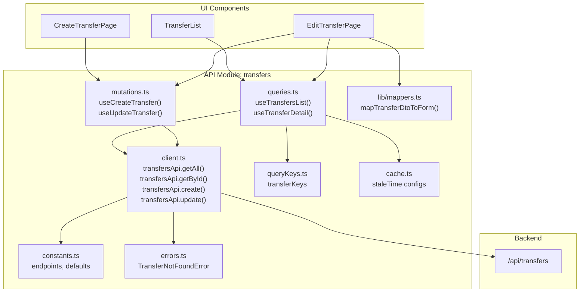

# API Refactoring Plan — Frontend Module Structure

## Цель

Разнести текущий плоский API-слой (`apps/web/src/api/transfers/`) в модульную структуру с единым шаблоном для каждого модуля. Каждый модуль API получает папки `api/` и `lib/` с чётко определёнными файлами.

## Текущее состояние

```
apps/web/src/api/
└── transfers/
    ├── index.ts              # re-exports
    ├── types.ts              # DTO types
    ├── create-transfer.ts    # fetch-функция
    ├── get-transfer-by-id.ts # fetch-функция + ошибка
    ├── get-transfers.ts      # fetch-функция + константа
    └── update-transfer.ts    # fetch-функция
```

Проблемы:
- Нет единообразия — функции разбросаны по отдельным файлам
- Нет разделения на client/constants/errors/queries/mutations
- Query-ключи и cache-настройки захардкожены в компонентах
- Маппинг DTO → UI тип живёт в `modules/transfers/edit-transfer/hooks/use-transfer.ts`
- Avia-transfers API вообще нет (моковые данные)

## Целевая структура

```
apps/web/src/api/
├── transfers/
│   ├── api/
│   │   ├── client.ts         # transfersApi object with methods
│   │   ├── constants.ts      # endpoints, defaults
│   │   ├── errors.ts         # error enums/classes
│   │   ├── mutations.ts      # useMutation wrappers
│   │   ├── queries.ts        # useQuery wrappers
│   │   ├── queryKeys.ts      # query key factories
│   │   └── cache.ts          # cache/staleTime configs
│   ├── lib/
│   │   └── mappers.ts        # DTO → UI type mappers
│   └── index.ts              # public re-exports
├── avia-transfers/
│   ├── api/
│   │   ├── client.ts
│   │   ├── constants.ts
│   │   ├── errors.ts
│   │   ├── mutations.ts
│   │   ├── queries.ts
│   │   ├── queryKeys.ts
│   │   └── cache.ts
│   ├── lib/
│   │   └── mappers.ts
│   └── index.ts
├── cargo/
│   ├── api/
│   │   ├── client.ts
│   │   ├── constants.ts
│   │   ├── errors.ts
│   │   ├── mutations.ts
│   │   ├── queries.ts
│   │   ├── queryKeys.ts
│   │   └── cache.ts
│   ├── lib/
│   │   └── mappers.ts
│   └── index.ts
├── transporters/
│   ├── api/
│   │   ├── client.ts
│   │   ├── constants.ts
│   │   ├── errors.ts
│   │   ├── mutations.ts
│   │   ├── queries.ts
│   │   ├── queryKeys.ts
│   │   └── cache.ts
│   ├── lib/
│   │   └── mappers.ts
│   └── index.ts
├── receivers/
│   ├── api/
│   │   ├── client.ts
│   │   ├── constants.ts
│   │   ├── errors.ts
│   │   ├── mutations.ts
│   │   ├── queries.ts
│   │   ├── queryKeys.ts
│   │   └── cache.ts
│   ├── lib/
│   │   └── mappers.ts
│   └── index.ts
└── index.ts                  # re-exports all modules
```

## Детальный план по шагам

### Шаг 1: Создать новую директорию `api/transfers/api/` и `api/transfers/lib/`

### Шаг 2: Наполнить `transfers/api/` файлами

#### 2.1 `constants.ts`
- Вынести `DEFAULT_TRANSFERS_QUERY` из `get-transfers.ts`
- Определить `TRANSFERS_ENDPOINT = '/api/transfers'`

#### 2.2 `errors.ts`
- Вынести `TransferNotFoundError` из `get-transfer-by-id.ts`
- Создать enum `TransferError` с кодами ошибок

#### 2.3 `client.ts`
- Создать объект `transfersApi` с методами:
  - `getAll(params)` — из `get-transfers.ts`
  - `getById(id)` — из `get-transfer-by-id.ts`
  - `create(input)` — из `create-transfer.ts`
  - `update(id, input)` — из `update-transfer.ts`
- Все типы импортируются из `../index.ts` (который re-export из `types.ts`)

#### 2.4 `queryKeys.ts`
- Вынести хардкодные ключи:
  - `['transfers']` → `transferKeys.all`
  - `['transfers', searchQuery]` → `transferKeys.list(searchQuery)`
  - `['transfer', id]` → `transferKeys.detail(id)`

#### 2.5 `cache.ts`
- Определить настройки:
  - `staleTime` для списка
  - `staleTime` для деталей
  - `gcTime`

#### 2.6 `queries.ts`
- Обёртки над `useQuery`:
  - `useTransfersList(params)` — для списка
  - `useTransferDetail(id)` — для деталей

#### 2.7 `mutations.ts`
- Обёртки над `useMutation`:
  - `useCreateTransfer()` — создание
  - `useUpdateTransfer(id)` — обновление

#### 2.8 `lib/mappers.ts`
- Вынести маппинг из `use-transfer.ts`:
  - `mapTransferDtoToForm(dto)` — DTO → UI Transfer
  - `mapFormToCreatePayload(form)` — UI → CreateTransferPayload
  - `mapFormToUpdatePayload(form)` — UI → UpdateTransferPayload

### Шаг 3: Создать `avia-transfers` API модуль

- Пока без реальных эндпоинтов (бэкенда нет)
- `client.ts` — пустой объект `aviaTransfersApi` с заглушками
- `constants.ts` — `AVIA_TRANSFERS_ENDPOINT = '/api/avia-transfers'`
- `errors.ts` — пустой enum
- `mutations.ts`, `queries.ts`, `queryKeys.ts`, `cache.ts` — заглушки
- `lib/mappers.ts` — заглушки

### Шаг 4: Создать пустые заготовки для `cargo`, `transporters`, `receivers`

- Каждый модуль получает полную структуру папок
- Все файлы — заглушки с комментарием `// TODO: implement when backend is ready`

### Шаг 5: Обновить `api/index.ts` (корневой)

- Re-export всех модулей: `transfers`, `avia-transfers`, `cargo`, `transporters`, `receivers`

### Шаг 6: Обновить импорты во всём codebase

Файлы, которые нужно изменить:

| Файл | Старый импорт | Новый импорт |
|------|--------------|--------------|
| `modules/transfers/transfer-list/components/transfer-list.tsx` | `import { getTransfers, DEFAULT_TRANSFERS_QUERY } from '~api/transfers'` | `import { useTransfersList } from '~api/transfers/api/queries'` + `import { DEFAULT_TRANSFERS_QUERY } from '~api/transfers/api/constants'` |
| `modules/transfers/create-transfer/create-transfer-page.tsx` | `import { createTransfer } from '~api/transfers'` | `import { useCreateTransfer } from '~api/transfers/api/mutations'` |
| `modules/transfers/edit-transfer/edit-transfer-page.tsx` | `import { updateTransfer } from '~api/transfers'` | `import { useUpdateTransfer } from '~api/transfers/api/mutations'` |
| `modules/transfers/edit-transfer/hooks/use-transfer.ts` | `import { getTransferById, TransferNotFoundError } from '~api/transfers'` | `import { useTransferDetail } from '~api/transfers/api/queries'` + маппер из `lib/mappers.ts` |

### Шаг 7: Удалить старые файлы

Удалить:
- `apps/web/src/api/transfers/create-transfer.ts`
- `apps/web/src/api/transfers/get-transfer-by-id.ts`
- `apps/web/src/api/transfers/get-transfers.ts`
- `apps/web/src/api/transfers/update-transfer.ts`
- `apps/web/src/api/transfers/types.ts` (содержимое перенесено в `api/types.ts` или оставлено как re-export)

### Шаг 8: Проверить сборку

- `yarn build` (или `tsc -b && vite build`) должен проходить без ошибок

## Схема потоков данных



## Структура `index.ts` (public API модуля)

```typescript
// api/transfers/index.ts
export { transfersApi } from './api/client';
export { TRANSFERS_ENDPOINT, DEFAULT_TRANSFERS_QUERY } from './api/constants';
export { TransferNotFoundError, TransferError } from './api/errors';
export { useCreateTransfer, useUpdateTransfer } from './api/mutations';
export { useTransfersList, useTransferDetail } from './api/queries';
export { transferKeys } from './api/queryKeys';
export { transfersCacheConfig } from './api/cache';
export { mapTransferDtoToForm, mapFormToCreatePayload, mapFormToUpdatePayload } from './lib/mappers';
export type * from './api/types';
```

## Примечания

- `types.ts` остаётся в `api/transfers/api/types.ts` (переименовать из корня)
- `avia-transfers` API пока без реальных запросов — только структура
- Для `cargo`, `transporters`, `receivers` — пустые заготовки, которые будут наполняться по мере готовности бэкенда
- Все query-ключи централизованы в `queryKeys.ts` — это позволит легко инвалидировать кэш